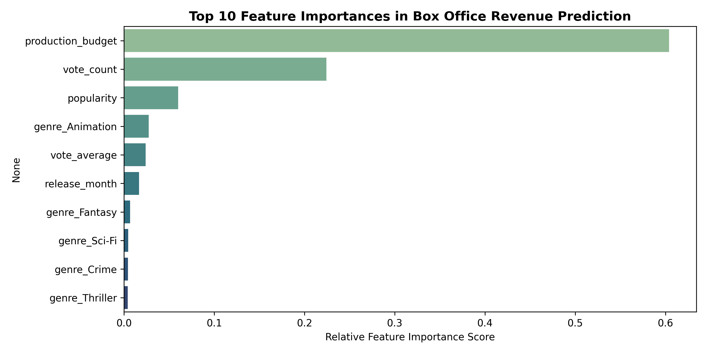
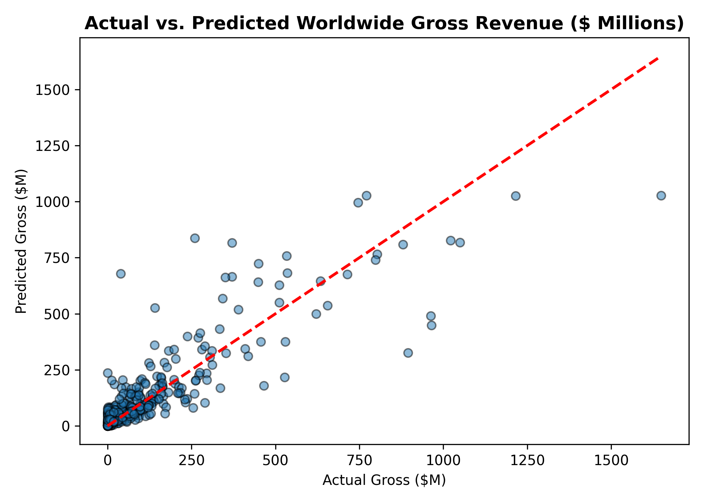
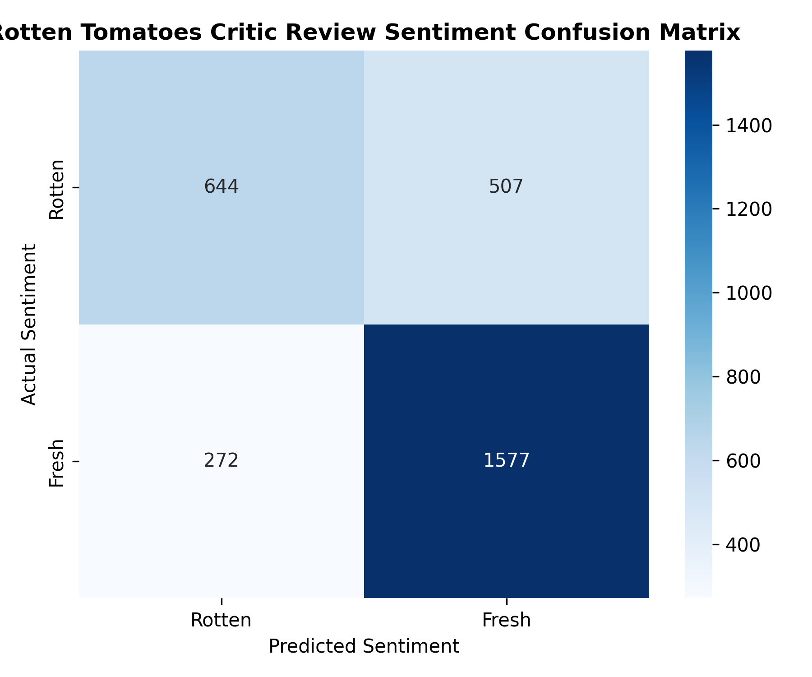

# 🎬 Microsoft Film Studio: Movie Industry Market Analysis & ML Predictor

[](https://www.python.org/)
[](https://pandas.pydata.org/)
[](https://scikit-learn.org/)
[](https://matplotlib.org/)
[](https://www.themoviedb.org/)
[](https://www.crummy.com/software/BeautifulSoup/)
[](https://jupyter.org/)

An executive data science consultation, multi-source ETL pipeline, and supervised machine learning suite evaluating box office revenues, net return on investment (ROI), runtime sweet-spots, genre combinations, and critic sentiment to guide Microsoft's capital allocation into original film production.

---

## 📌 Executive Summary & Business Context

Microsoft sees tech industry peers aggressively expanding into original film and video content. To launch its own content creation studio successfully without prior film production experience, Microsoft's leadership required empirical, data-driven market intelligence and predictive analytics on box office dynamics.

This project answers 4 primary strategic questions posed by executive decision-makers:
1. **Genre Capital Allocation**: Which film genres yield the highest gross earnings, customer ratings, and net profit margins?
2. **Runtime Sweet-Spots**: What are the optimal film durations per genre, and how does runtime impact box office revenue?
3. **Seasonal Release Windows**: What is the most lucrative month and season to release new titles?
4. **Genre Synergy ("Binary Genres")**: Which multi-genre pairings maximize return on investment (ROI)?

```
┌─────────────────────────────────────────────────────────────────────────┐
│                   END-TO-END DATA & ML ARCHITECTURE PIPELINE            │
└─────────────────────────────────────────────────────────────────────────┘
   Multi-Source Ingestion (IMDb, Mojo, RT) ──►  Web Scraping (IMDbPro) + TMDB API
                     │                                         │
                     ▼                                         ▼
   Wrangling & Binary Genre Engineering   ──►  Exploratory Visual Analytics
                     │                                         │
                     ▼                                         ▼
   Supervised ML Revenue Regression ($M) ──►  NLP Critic Sentiment Classifier
```

---

## 🤖 Production Machine Learning & NLP Analytics Engine

Beyond exploratory data analysis, this repository includes two active, production-grade Machine Learning and Natural Language Processing modules:

### 1. Supervised Box Office Revenue Predictor (`Predictive_ROI_Modeling.ipynb`)
- **Model Architecture**: Random Forest Regressor trained on production budget, release seasonality, TMDB popularity scores, vote counts, and binary genre indicators across 1,976 enriched movie titles.
- **Performance Validation**: With TMDB engagement features included (`popularity`, `vote_average`, `vote_count`), $R^2 = 0.7385$, MAE = **$52.10M**, RMSE = **$103.35M**. Those three features accumulate *after* a film's release and are partly a function of the box-office outcome itself — dropping them and re-fitting the identical model drops $R^2$ to **0.5287** (MAE $72.89M, RMSE $138.75M). **0.5287 is the number that reflects predictive signal available before a film releases**; 0.7385 is reported alongside it as the leaky comparison, not the headline. See the notebook's leakage-check cell for the ablation.
- **Top Financial Drivers**: Production budget, TMDB popularity index, release month, and Animation/Adventure/Sci-Fi genre flags emerged as top revenue predictors.

<div align="center">
  
  <p><em>Figure 1: Top 10 Feature Importances in predicting worldwide box office gross.</em></p>
</div>

<div align="center">
  
  <p><em>Figure 2: Actual vs. Predicted Worldwide Gross Revenue ($ Millions).</em></p>
</div>

---

### 2. NLP Critic Review Sentiment Engine (`NLP_Review_Sentiment_Analysis.ipynb`)
- **Model Architecture**: TF-IDF Vectorization (2,500 n-gram features) paired with a Logistic Regression classifier. Sourced from **54,432 Rotten Tomatoes critic reviews** (`Data/rt.reviews.tsv`); **48,869** have both review text and a fresh/rotten label and are used for training — all of them, not a sample.
- **Performance Validation**: Achieved **75.3% Classification Accuracy** and **ROC-AUC = 0.8233** in distinguishing *Fresh* vs. *Rotten* critic reviews.

<div align="center">
  
  <p><em>Figure 3: Rotten Tomatoes Critic Review Sentiment Confusion Matrix.</em></p>
</div>

---

## 🛠️ Data Engineering & Multi-Source ETL Pipeline

Baseline datasets provided for box office analysis contained severe missing data gaps. To overcome these limitations, an end-to-end multi-source data ingestion and enrichment pipeline was engineered:

### Data Sources Ingested & Merged
| Source | Format | Records Ingested | Primary Features Used |
| :--- | :--- | :--- | :--- |
| **IMDb Data Dumps** | CSV / TSV | 5+ Tables | Title basics, ratings, crew, runtime, principals |
| **TheNumbers (`tn.movie_budgets.csv`)** | CSV | 5,782 | Production budget, domestic gross, worldwide gross |
| **Box Office Mojo (`bom.movie_gross.csv`)** | CSV | 3,387 | Annual box office gross, studio |
| **Rotten Tomatoes (`rt.reviews.tsv`)** | TSV | 54,432 | Critic review text, rating, fresh/rotten status |
| **TMDB API Export (`tmdb.movies.csv`)** | CSV / REST API | 26,519 | Popularity indices, vote counts, release dates, TMDB genre codes |
| **Custom IMDbPro Scraping** | Web / HTML | 14,428 | Consolidated budget, gross, region codes, ratings |

### Key Engineering Innovations
- **IMDbPro DOM Scraping Engine**: Designed a custom JavaScript console auto-scroller combined with BeautifulSoup HTML parsing to bypass login lazy-loading limits, expanding viable datapoints to over 14,000 complete records.
- **TMDB REST API Integration**: Integrated `tmdbsimple` framework and TMDB REST API endpoints to capture worldwide popularity scores and vote counts across 26,500+ titles.
- **"Binary Genre" Taxonomy**: Solved multi-label genre noise by engineering a composite *Binary Genre* feature (mapping the primary two core genres of a film).

---

## 📊 Strategic Market Insights & Findings

### High-ROI Genre Selection: Revenue vs. Net Profit
While high-budget Action/Adventure titles generate massive worldwide gross revenue, **Animation, Adventure, Sci-Fi, and Comedy** consistently demonstrate the highest net profit margins and capital efficiency.

| Genre Combination | Average Net Profit | Box Office Category |
| :--- | :--- | :--- |
| **Animation + Adventure** | **$310M+** | High-Yield Blockbuster |
| **Action + Adventure** | **$260M+** | High-Gross / High-Capital |
| **Drama + Romance** | **$65M+** | Mid-Budget Steady ROI |
| **Comedy + Romance** | **$55M+** | Low-Risk / High ROI |

<div align="center">
  
  <p><em>Figure 4: Net Profit comparison across top Binary Genres.</em></p>
</div>

---

## 📁 Repository Structure & Notebook Workflow

```
Movie-Industry-Market-Analysis/
├── Data/                             # Raw and processed datasets (IMDb, TMDB, Mojo, TheNumbers)
│   ├── tmdb.movies.csv               # TMDB API enriched dataset (26,519 rows)
│   ├── tn.movie_budgets.csv          # Financial budgets & worldwide gross
│   ├── rt.reviews.tsv                # Rotten Tomatoes critic reviews (54,432 rows)
│   └── movie_main.csv                # Master clean analytical dataset
├── images/                           # Analytical & ML chart outputs
│   ├── predictive_roi_features.png   # ML Feature Importances
│   ├── predictive_actual_vs_pred.png # Actual vs Predicted Revenue ($M)
│   ├── nlp_sentiment_confusion_matrix.png # NLP Sentiment Confusion Matrix
│   ├── profit_genres2.jpeg           # Financial EDA figures
│   └── ...
├── Predictive_ROI_Modeling.ipynb     # ML Notebook: Box Office Revenue Regression Model (R^2 = 0.74, 0.53 with engagement features ablated)
├── NLP_Review_Sentiment_Analysis.ipynb # NLP Notebook: Critic Review Sentiment Engine (AUC = 0.82)
├── data gathering.ipynb              # ETL Notebook: Scraping, API calls & data ingestion
├── Data_Cleaning_Exploration.ipynb   # Data Wrangling Notebook: Cleaning & feature engineering
├── Visualization.ipynb               # EDA Notebook: Statistical analysis & visualizations
├── presentation.pdf                  # 10-slide Executive Slide Deck for Leadership
├── README.md                         # Project documentation
└── .gitignore                        # Git configuration
```

---

## 💻 How to Run & Reproduce

### Prerequisites
- Python 3.7+
- Jupyter Notebook or JupyterLab

### Installation
1. Clone this repository:
   ```bash
   git clone https://github.com/GitHub-ccd/Movie-Industry-Market-Analysis.git
   cd Movie-Industry-Market-Analysis
   ```

2. Install required Python packages:
   ```bash
   pip install pandas numpy matplotlib seaborn scikit-learn beautifulsoup4 requests tmdbsimple
   ```

3. Launch Jupyter Notebook:
   ```bash
   jupyter notebook
   ```

4. Open and run notebooks:
   - `Predictive_ROI_Modeling.ipynb` *(Machine Learning Revenue Regressor)*
   - `NLP_Review_Sentiment_Analysis.ipynb` *(NLP Review Sentiment Classifier)*
   - `Visualization.ipynb` *(Exploratory Data Analysis)*

---

## 📄 License & Attribution
This project is open-source under the [MIT License](LICENSE.md).  
Designed & Developed by **Chamila** as part of the Healthcare Data Scientist Portfolio suite ([`ccdportfolio`](https://github.com/GitHub-ccd/ccdportfolio)).
